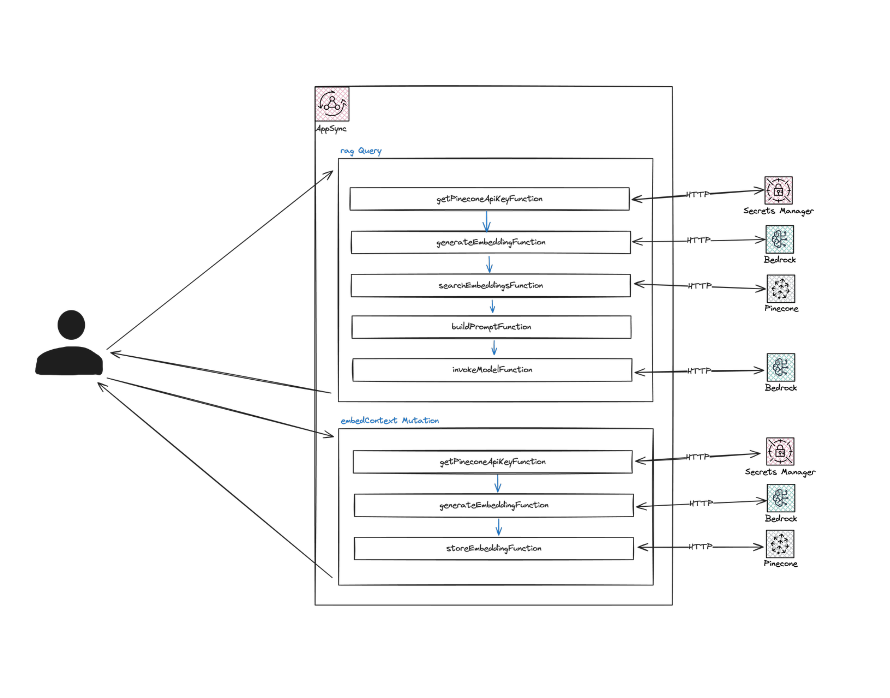

# The Computeless RAG Tool ⭐️

Hey folks! I’m excited to share a project that combines serverless and generative AI: the Computeless RAG tool. This tool taps into private data, like your company's internal databases, and leverages GenAI without requiring traditional AWS compute resources. Let’s dive into how this tool is built.

## 1. What is the Computless RAG Tool 🤷🏽‍♂️ ?

The Computeless RAG tool uses AWS AppSync to manage GenAI-driven queries without traditional compute resources. By leveraging AppSync's JavaScript to orchestrate the RAG pipeline, the architecture becomes simpler, faster, and more cost-effective.

Key components include:
- **Amazon Bedrock** for foundational models.
- **Pinecone** as the vector database.
- **AppSync JS resolvers** as the orchestrator.

This integration demonstrates AppSync's potential to serve as the backbone of a serverless GenAI system.

## 2. Technological Overview 🛠️
Let's explore the key technologies behind the Computeless RAG tool:

### 2.1 AWS AppSync
AWS AppSync serves as the central orchestrator, leveraging JavaScript pipeline resolvers to efficiently manage data sequence and context throughout the query and response process.

### 2.2 Pinecone
Pinecone serves as the vector database. It will allow for the storage of the internal data and quick retrieval of vector embeddings based on user queries.

### 2.3 AWS Secrets Manager
AWS Secrets Manager is used to secure sensitive credentials like the Pinecone API key, crucial for interfacing with the vector database.

### 2.4 Amazon Bedrock
Amazon Bedrock provides the AI power in the setup, serving two main functions:

- **Amazon Titan Text Embeddings**: This model transforms user queries into vector embeddings, crucial for querying the Pinecone database to fetch relevant data.
- **Anthropic Claude 3 Haiku**: After data retrieval, this model processes the information to generate accurate and contextually appropriate responses to the queries, leveraging its advanced natural language processing capabilities.

### 2.5 Integration Flow
The integration of these technologies is orchestrated through several steps:

1. **Secure API Key Retrieval**: Retrieve the Pinecone API key from AWS Secrets Manager to ensure secure access to the database.
2. **Embedding Generation**: Convert user queries into vector embeddings using the Titan model.
3. **Data Storage**: Insert vectors (and the corresponding text) into the Pinecone database for later retrieval.
4. **Data Retrieval**: Use these embeddings to locate the most relevant data vectors within the Pinecone database.
5. **Response Generation**: Employ Anthropic’s Claude 3 Haiku to formulate a final, contextual answer based on the retrieved data and the initial query.


## 3. Architecture and Workflow 🏗️

Let's now break down the architecture and workflow of the Computeless RAG tool, providing a detailed look at how each component interacts.

### 3.1 Architectural Overview


The architecture diagram illustrates the orchestration of services and data flow in the tool. Each GraphQL query or mutation to the AppSync API triggers a JavaScript pipeline resolver. This resolver runs a sequence of functions to interact with services, data sources, or manipulate data for the next step.

### 3.2 AppSync Pipeline Resolver Functions
AWS AppSync's pipeline resolvers are vital for complex data operations that require multiple steps. They enable you to define a sequence of function calls, each transforming the output and passing it to the next. This is ideal for workflows where data needs to be fetched, transformed, and used to generate responses, just like the Computeless RAG tool.

**Why Use Pipeline Resolvers?**

1. **Sequential Logic Execution**: Pipeline resolvers execute operations in sequence, where each step depends on the previous one, making them perfect for the use case.

2. **Decoupling Logic and Data Sources**: Each function in the pipeline can use different data sources or none at all, creating a cleaner architecture by separating data retrieval, processing, and response generation.

3. **Efficiency and Performance**: By handling data flow within AppSync, we reduce the need for external orchestration and cut down on latency from multiple network calls.

Each function in the pipeline is managed by individual JS files located in the `api/resolvers/functions` folder of the SAM project. This organization makes deployment and updates clear and manageable. Here’s how each function integrates into the pipeline:

#### 3.2.1 Get Pinecone API Key Function (`getPineconeApiKeyFunction.js`)
This function initiates the pipeline by securely retrieving the Pinecone API key from AWS Secrets Manager using an HTTP data source. The key is stored in `ctx.stash`, making it accessible to subsequent functions.

```javascript
import { util } from '@aws-appsync/utils'
export function request(ctx) { 
  return {
    "version": "2018-05-29",
    "method": "POST",
    "resourcePath": `/`,
    "params": {
      "headers": {
        "content-type": "application/x-amz-json-1.1",
        "X-Amz-Target": "secretsmanager.GetSecretValue"
      },
      "body": JSON.stringify({
        "SecretId": "pineconeApiKey",
      })
    }
  }
}
export function response(ctx) {
  if (ctx.error) util.error(ctx.error.message, ctx.error.type);
  if (ctx.result.statusCode === 200) {
    ctx.stash.pineconeApiKey = JSON.parse(ctx.result.body).SecretString
  } else {
    util.appendError(ctx.result.body, ctx.result.statusCode);
  }
}
```

#### 3.2.2 Generate Embedding Function (`generateEmbeddingFunction.js`)
With the API key secured, this function generates vector embeddings from the user's query. It uses an HTTP data source to send the query to Amazon Bedrock, which leverages the Titan Text Embeddings model to transform the query into vector embeddings. This step is crucial for accurately matching the query with relevant data in Pinecone.

```javascript
import { util } from '@aws-appsync/utils'
export function request(ctx) { 
  return {
    "version": "2023-09-30",
    "method": "POST",
    "resourcePath": `/model/amazon.titan-embed-text-v1/invoke`,
    "params": {
      "headers": {
        "content-type": "application/json",
        "accept": "*/*"
      },
      "body": JSON.stringify({
        "inputText": ctx.args.query,
      })
    }
  };
}
export function response(ctx) {
  if (ctx.error) util.error(ctx.error.message, ctx.error.type);
  if (ctx.result.statusCode === 200) {
    ctx.stash.queryEmbedding = JSON.parse(ctx.result.body).embedding
  } else {
    util.appendError(ctx.result.body, ctx.result.statusCode);
  }
}
```

#### 3.2.3 Store Embedding Function (`storeEmbeddingFunction.js`)
This function is used to store an embedding in the Pinecone database. It uses an HTTP data source to execute this operation.

```javascript
import { util } from '@aws-appsync/utils'
export function request(ctx) { 
  return {
    "method": "POST",
    "resourcePath": `/vectors/upsert`,
    "params": {
      "headers": {
        "Content-Type": "application/json",
        "Api-Key": ctx.stash.pineconeApiKey
      },
      "body": JSON.stringify({
        "namespace": "computeless-rag",
        "vectors": [{
          "id": util.autoId(),
          "values": ctx.stash.queryEmbedding,
          "metadata": { "text": ctx.args.query }
        }]
      })
    }
  };
}
export function response(ctx) {
  if (ctx.error) util.error(ctx.error.message, ctx.error.type);
  if (ctx.result.statusCode === 200) {
    console.log("PINECONE - VECTOR UPSERT SUCCESS")
  } else {
    util.appendError(ctx.result.body, ctx.result.statusCode);
  }
}
```

#### 3.2.4 Search Embeddings Function (`searchEmbeddingsFunction.js`)
This function uses an embedding to search the Pinecone database for the most relevant entries. It uses an HTTP data source to perform the query, retrieving data that closely matches the user's initial inquiry based on the previously generated embeddings.

```javascript
import { util } from '@aws-appsync/utils'
export function request(ctx) { 
  return {
    "method": "POST",
    "resourcePath": `/query`,
    "params": {
      "headers": {
        "Content-Type": "application/json",
        "Api-Key": ctx.stash.pineconeApiKey
      },
      "body": JSON.stringify({
        "namespace": "computeless-rag",
        "vector": ctx.stash.queryEmbedding,
        "topK": 3,
        "includeMetadata": true
      })
    }
  };
}
export function response(ctx) {
  if (ctx.error) util.error(ctx.error.message, ctx.error.type);
  if (ctx.result.statusCode === 200) {
    ctx.stash.queryContexts = JSON.parse(ctx.result.body).matches.map(match => match.metadata.text)
  } else {
    util.appendError(ctx.result.body, ctx.result.statusCode);
  }
}
```

#### 3.2.5 Build Prompt Function (`buildPromptFunction.js`)
This function does not interact with any data sources and is responsible for assembling the final prompt. It combines the initial query, contextual data from Pinecone, and specific instructions for the language model to create a comprehensive input. This step is crucial for ensuring that the AI model generates relevant and accurate responses.

```javascript
export function request(ctx) { return {} }
export function response(ctx) {
  ctx.stash.prompt = `
    <Question> ${ctx.args.query}</Question>
    <Contextual Information>: 
      *${ctx.stash.queryContexts.join("\n*")}
    </Contextual Information>
    <Instructions>
      1. Provide a direct and concise answer to the question based on your knowledge, without explicitly referencing or mentioning the provided "Contextual Information".
      2. Respond as an HR assistant who has internalized the relevant information, without indicating separate context pieces or referencing them directly.
      3. If you do not have enough information to answer the question, respond with 'I do not have the necessary information to answer.', nothing more, nothing less.
      4. Avoid any meta-references to the process of consulting the "Contextual Information" provided or the structure of this query.
      5. Keep your answer as short as possible while still fully addressing the question.
      6. Validate that you are complying to ALL the above instructions before answering any question.
    </Instructions>
    Your Answer:
  `
}
```

#### 3.2.6 Invoke Model Function (`invokeModelFunction.js`)
The final function in the pipeline sends the assembled prompt to Anthropic’s Claude 3 Haiku model via Amazon Bedrock using an HTTP data source. This function obtains the final answer to the user’s query, demonstrating the GenAI’s ability to process and respond to complex inquiries effectively.

```javascript
import { util } from '@aws-appsync/utils'
export function request(ctx) { 
  return {
    "version": "2023-09-30",
    "method": "POST",
    "resourcePath": `/model/anthropic.claude-3-haiku-20240307-v1:0/invoke`,
    "params": {
      "headers": {
        "content-type": "application/json",
        "accept": "*/*"
      },
      "body": JSON.stringify({
        "anthropic_version": "bedrock-2023-05-31",
        "max_tokens": 1000,
        "messages": [
          {
            "role": "user",
            "content": [
              {
                "type": "text",
                "text": ctx.stash.prompt
              }
            ]
          }
        ]
      })
    }
  }
}
export function response(ctx) {
  if (ctx.error) util.error(ctx.error.message, ctx.error.type);
  if (ctx.result.statusCode === 200) {
    ctx.stash.queryAnswer = JSON.parse(ctx.result.body).content[0].text
  } else {
    util.appendError(ctx.result.body, ctx.result.statusCode);
  }
}
```

### 3.3 Pipeline Resolvers

#### 3.3.1 `embedContext` Mutation

The `embedContext` mutation in the AppSync architecture is crucial for populating the Pinecone database with data. This mutation converts the user query into embeddings and stores it into the vector store making it available for retrieval in the `rag` query.

The mutation triggers a pipeline resolver composed of the following functions in sequence:

- `getPineconeApiKeyFunction`
- `generateEmbeddingFunction`
- `storeEmbeddingFunction`

#### 3.3.2 `rag` Query

The `rag` Query is the core functionality of the Computeless RAG tool, designed to retrieve and generate responses based on user queries. This GraphQL query makes a semantic search on the Pinecone database based on the user query, it then generates an answer using Claude 3 Haiku.

The query triggers a pipeline resolver composed of the following functions in sequence:
  - `getPineconeApiKeyFunction`
  - `generateEmbeddingFunction`
  - `searchEmbeddingsFunction`
  - `buildPromptFunction`
  - `invokeModelFunction`

## 4. SAM Project Structure 📝
The AWS Serverless Application Model (SAM) simplifies creating and deploying serverless applications on AWS. In the Computeless RAG tool project, the SAM template (`template.yaml`) and the GraphQL schema (`schema.graphql`) are key components defining the infrastructure and API interface.

### 4.1 Overview of `template.yaml`
The `template.yaml` file defines the resources necessary for deploying the Computeless RAG tool on AWS. Here’s a breakdown of the primary components:

- **AWS::Serverless::GraphQLApi**: This resource creates the AppSync API. It uses the GraphQL schema provided in the schema.graphql file. The API is configured with API keys for authentication and connected to various data sources and resolvers for handling operations.

- **AWS::Serverless::GraphQLApi - Functions**: Functions are defined for each step in the AppSync pipeline resolver, mapped to specific JavaScript files. Those functions have been covered in the **AppSync Pipeline Resolver Functions** section above.
- **AWS::IAM::Role**: Defines the roles required for the AppSync data sources to interact with AWS services securely. Each role includes policies that grant necessary permissions for actions like retrieving secrets or invoking AI models.
- **AWS::AppSync::DataSource**: In the SAM template, we are defining 3 AppSync HTTP datasources. They allow us to make HTTP calls on Pinecone, Amazon Bedrock and AWS Secrets Manager from within our AppSync pipeline resolvers.

### 4.2 Understanding `schema.graphql`
The `schema.graphql` file defines the GraphQL schema used by the AppSync API. Here’s the structure:

```graphql
type QueryOutput { output: String! }
type Query { rag(query: String!): QueryOutput }

type MutationOutput { output: Boolean! }
type Mutation { embedContext(query: String!): MutationOutput }
```

This schema sets up a simple API with a single type of query (`rag`) that accepts a string and returns a `QueryOutput` type containing a string field output. This setup handles the Q&A functionality of the tool, allowing users to submit queries and receive text responses.

It also exposes a mutation `embedContext` that we will use to populate the Pinecone database.

### 4.3 The AppSync resolver functions folder

As mentioned in section 3, the `api/resolvers/functions` folder contains the js files representing the AppSync resolver functions that will be executed in the pipeline resolver whenever the GraphQL `rag` is invoked.

### 4.4 Deploying the SAM project

Deploying this SAM project involves several steps streamlined by the SAM CLI, a command-line tool that allows you to build, test, and deploy AWS serverless applications using SAM templates. Here’s how to deploy the project:

**Pre-Requisites:**

- Clone the project on your local computer
- Install AWS CLI and configure it with your AWS account credentials.
- Install the AWS SAM CLI.
- Create a Pinecone account, a Pinecone index with `1536` dimension (same as the output vector generated by Amazon Titan Text Embeddings) and copy the Pinecone API key and newly created index host from your account.
- Create a plaintext secret on AWS Secrets Manager. Name of the secret should be `pineconeApiKey` and value is the API key copied from your Pinecone account.
- Update the `YOUR_PINECONE_INDEX_HOST` in the `template.yaml` file with the value you copied from your Pinecone account.
- Make sure to enable the following models on the [Amazon Bedrock Console](https://console.aws.amazon.com/bedrock/home):
  - `amazon.titan-embed-text-v1`
  - `anthropic.claude-3-haiku-20240307-v1:0`

**Build the Project:**

- Navigate to the project directory in your terminal.
- Run the command: `sam build`. This command prepares the deployment by building any dependencies specified in the template.

**Deploy the Project:**

- After building the project, deploy it by running: `sam deploy --guided`.
  - The guided deployment process will prompt you to enter parameters such as the stack name, AWS region, and any parameters required by the template.
  - Confirm the settings and proceed with the deployment. The CLI will handle the creation of all specified resources and provide you with an output that includes the URL of the deployed AppSync API.


## 5. Testing the Computeless RAG Tool 🧪

Now that the Computeless RAG Tool is successfully deployed, let's go ahead and test it.

### 5.1 Populating the Pinecone index
In order to test the tool, we need to populate some data in the Pinecone database. In order to do so, we have deployed a mutation called `embedContext`. Let's add a few entries in the Pinecone index.

1. Navigate to the AWS AppSync console
2. Select the API you just deployed. It should be named `ComputelessRagApi`
3. Click on Queries
4. Paste the following in the query editor
    ```graphql
    mutation Mutation1 {
      embedContext(query: "Project Description: Fluffernutter Technologies is thrilled to announce its latest innovation, Project Tofu Thunderstorm. This groundbreaking technology aims to revolutionize the food industry by enabling cloud-based 3D printing of tofu with customizable shapes, flavors, and textures, directly into consumers' kitchens. Initial shapes include \"Lightning Bolt Lemon\" and \"Cumulus Cloud Curry.\"") {
        output
      }
    }
    mutation Mutation2 {
      embedContext(query: "Award Citation: For the first time in corporate history, Fluffernutter Technologies Inc. is proud to award the Employee of the Month to Garry the Goldfish. Garry has demonstrated exceptional dedication by swimming around his bowl approximately 3,572 times this month, inspiring his team with his relentless pursuit of... well, his tail. Garry's unwavering commitment to circling his bowl has set a new standard for persistence and determination at Fluffernutter.") {
        output
      }
    }
    mutation Mutation3 {
      embedContext(query: "Internal Memo: It's been revealed that the key ingredient in Fluffernutter's cafeteria's infamous \"Secret Sauce\" is not the exotic spice blend previously thought but is, in fact, just a generous dollop of plain, unsweetened yogurt. This revelation has shocked employees, many of whom had been on a quest to decode the recipe. The culinary team assures everyone that the yogurt is organic and sourced from cows that listen exclusively to classical music.") {
        output
      }
    }
    mutation Mutation4 {
      embedContext(query: "Event Recap: Fluffernutter Technologies hosted its annual Great Office Chair Race, where departments compete in a high-stakes relay race through the office corridors. This year’s winning team, \"The Speedy Swivellers,\" utilized a controversial but effective technique involving copious amounts of olive oil on the wheels and a propulsion system fashioned from repurposed computer fans. Questions about the fairness of their tactics were raised but ultimately dismissed in the spirit of innovation and fun.") {
        output
      }
    }
    mutation Mutation5 {
      embedContext(query: "Strategy Meeting Notes: The Q3 objective for Fluffernutter Technologies is to finalize the development of Project Unicorn, a secretive endeavor that seeks to create the world’s first holographic pet that can assist with coding tasks. Early prototypes suggest that the holographic unicorn, named \"CodeHoof,\" prefers JavaScript over Python but struggles with existential questions when debugging.") {
        output
      }
    }
    mutation Mutation6 {
      embedContext(query: "Investigation Report: A three-week investigation into the mystery of the disappearing donuts from the break room has concluded. The culprit, a highly intelligent and daring raccoon named Ricky, has been apprehended. Ricky had been using the company's prototype teleportation device, Project Wormhole Waffle, to enter and exit the premises undetected. In light of his ingenuity, Ricky has been offered an internship with the R&D team.") {
        output
      }
    }
    mutation Mutation7 {
      embedContext(query: "Memo to Staff: In an unprecedented move, Fluffernutter Technologies Inc. announces this year's corporate retreat will be held on Mars, in collaboration with SpaceY. Employees are reminded to submit their dietary preferences for space food and to complete their zero-gravity training by the end of the month. The HR department has assured all participants that Wi-Fi will be available to ensure uninterrupted productivity during the retreat.") {
        output
      }
    }
    mutation Mutation8 {
      embedContext(query: "Wellness Program Update: As part of its commitment to employee well-being, Fluffernutter Technologies has introduced a new mindfulness and meditation program led by AI-powered Mecha-Marmots. These robotic rodents are equipped with soothing LED eyes and emit calming nature sounds. Early feedback suggests a marked improvement in stress levels, although some employees find the Mecha-Marmots’ continuous mechanical chewing somewhat less than relaxing.") {
        output
      }
    }
    mutation Mutation9 {
      embedContext(query: "Internal Communication: To foster a unique company culture, Fluffernutter Technologies has developed its own secret language, FlufferSpeak. This language simplifies complex technological concepts into whimsical terms. For example, a \"bug\" is now referred to as a \"noodle,\" and \"debugging\" is \"noodle-nabbing.\" Employees are encouraged to use FlufferSpeak during meetings to lighten the mood and enhance team bonding.") {
        output
      }
    }
    ```
5. Run all 9 mutations by clicking on the `Run` button and selecting the corresponding mutation

### 5.2 Asking questions

With "private" data stored in the Pinecone index, we can now query the tool.

1. Navigate to the AWS AppSync console
2. Select the API you just deployed.
3. Click on Queries
4. Paste the following in the query editor
    ```graphql
    query negativeQuery {
      rag(query: "Is Fluffernutter Technologies planning to hire snails in the foreseable future ?") {
        output
      }
    }
    query positiveQuery {
      rag(query: "What are we doing for employee wellbeing ?") {
        output
      }
    }
    ```
5. Run both queries by clicking on the `Run` button and selecting the corresponding query.
   1. With the negative query, the tool should mention it does not have the necessary information to answer your question.
   2. With the positive query, it should provide you with an answer incorporating information that you have inserted into your Pinecone index in the previous section.

### 5.3 Cleanup

In order to remove the AWS resources created in this tutorial, just run the followin command: `sam delete`

## 6. Conclusion 🌅
   
Developing the Computeless RAG tool has showcased how seamlessly serverless architectures can integrate with generative AI to handle complex queries from private datasets, leveraging AWS AppSync, Amazon Bedrock, and Pinecone.

### Potential Improvements:

- **Amazon Cognito**: Use for user authentication and authorization, allowing access only to data from their respective companies. Cognito integrates seamlessly with AWS AppSync.
- **AWS Secrets Manager**: Each API request fetches secrets, which has two downsides:
  1. Costs for secret retrieval with each request, balanced by savings from not using compute resources like Lambda functions.
  2. Secrets may appear in plaintext in CloudWatch logs when logging is enabled, exposing the Pinecone API key. [Amazon CloudWatch Logs data protection](https://docs.aws.amazon.com/AmazonCloudWatch/latest/logs/mask-sensitive-log-data.html) can mitigate this.
- **Data Ingestion with Bedrock Knowledge Bases**: For the data ingestion part in the vector datastore, using Bedrock Knowledge Bases could be an effective option.
- **Date Retrieval with Bedrock Knowledge Bases**: Instead of manually embedding the user query and making the vector search on Pinecone, using the Retrieve API for Amazon Bedrock Knowledge Bases can be an "AWS managed" way of doing things. This approach combines the functionalities of the `generateEmbeddingFunction` and `searchEmbeddingsFunction` into a single function, streamlining the process and leveraging AWS-managed services.

### Additional Considerations

I acknowledge that other solutions are possible, and my point here is to present AppSync as one of the options among many, offering the luxury of choice.

- **Step Functions**: Step Functions can also avoid compute and orchestrate your RAG pipeline, but with a different cost structure. You pay for executions and GB-seconds, which can add up depending on your use case. Compute time adds to the overall cost and network hops can introduce some additional latency.
- **Lambda with Bedrock**: Using AWS Lambda functions with Amazon Bedrock can handle complex queries and integrate with various data sources. This approach involves costs associated with Lambda invocations and execution time, potentially adding latency.
- **Lambda with Bedrock Knowledge Bases**: Combining Lambda with Bedrock Knowledge Bases enhances capabilities by providing managed knowledge bases. This approach also involves costs associated with Lambda invocations and execution time, potentially adding latency.

Regardless of the chosen method, using Bedrock incurs a cost. The key difference is that with Lambda or Step Functions, compute time is an additional cost. The advantage of AppSync for this use-case is that it offers 30 seconds of "free" compute time to connect to data sources and execute the linear RAG logic, potentially offering cost savings compared to other options.

In summary, I am not trying to convince that AppSync is the go-to solution for all cases. Rather, I aim to share that AppSync is a lesser-known yet viable option for building serverless, GenAI-driven applications. This adds to the range of choices available to developers, enabling them to select the best tool for their specific needs.

Thank you for joining me on this exploration of the Computeless RAG Tool! I hope you enjoyed reading this as much as I enjoyed building it. Find the code in the [following repo](https://github.com/aphilippartd/computeless-rag).